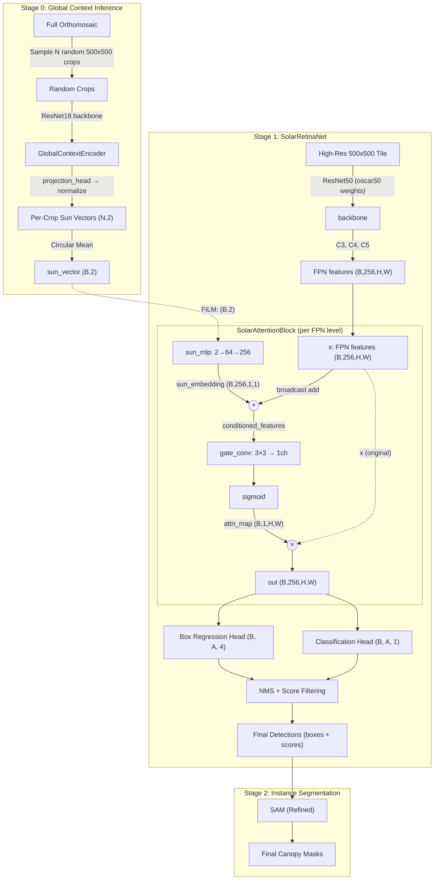

# Solar-Gated Detection Pipeline Architecture

## Description of Components

### 1. Global Context Encoder (Stage 0)
*   **Input:** N random 500x500 crops from the orthomosaic (using existing pre-tiled training data).
*   **Model:** Lightweight CNN (ResNet18).
*   **Inference:** Sample ~30 crops, predict sun vector for each, compute **circular mean** for consensus.
*   **Training Objective:** **Self-Supervised Rotation Consistency**.
    *   We rotate the input image $I$ by angle $\theta$.
    *   The output vector $\vec{z}$ must rotate by $\theta$.
    *   This forces $\vec{z}$ to lock onto the strongest directional signal (shadows).

### 2. Solar Attention Gate (The Core Innovation)
*   **Location:** Inserted after the FPN, before the RetinaNet prediction heads.
*   **Mechanism:** Projects `SunVector` via MLP to create a per-channel bias (FiLM conditioning), adds this to FPN features, then applies a **3×3 conv** to generate a spatial attention map.
*   **Effect:** Learns to detect shadow-consistent patterns: *"If Sun is North and I see dark-to-the-south-of-bright, boost attention here."*

